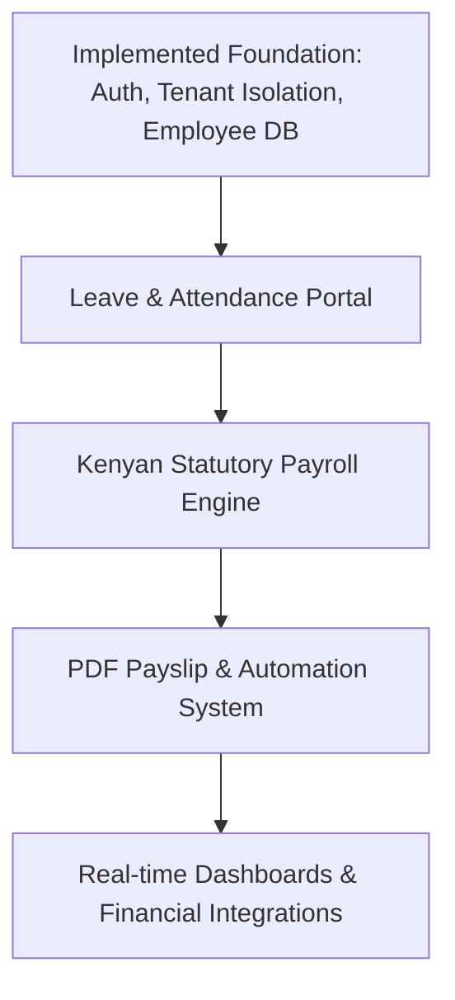

# WorkWise SaaS — Comprehensive Status, Roadmap & Security Architecture Report

This report provides an exhaustive, production-grade review of the current implementation state, future functional milestones, and the complete end-to-end security architecture of the WorkWise HR & Payroll platform. 

---

## 🗺️ Part 1: Comprehensive Project Progress (Achieved vs. Pending)

### 🏆 1. What We Have Achieved (Fully Implemented)

We have built a premium, highly secure foundation for a multi-tenant SaaS application, optimizing both user onboarding and core backend database query performance.

#### A. Authentication & Dynamic Multi-Tenant Onboarding Wizard
- **Next.js Premium Wizard:** Replaced generic authentication screens with a multi-step user experience. 
  - *Step 1 (Plan Selection):* Interactive cards showcasing plans (**Starter, Growth, Business, Enterprise**) with localized KES pricing, employee seat caps, and dynamic visual indicators.
  - *Step 2 (Organization & Admin Setup):* Captures company details, administrator credentials, and contacts.
- **Clerk Metadata Transfer:** Leveraged Clerk's `unsafeMetadata` to securely hold the organization name and chosen plan payload on the frontend and pass it seamlessly to the user record during Clerk registration.
- **Webhook Provisioning Engine:** Created a secure API endpoint at `/api/webhooks/clerk/` that processes user synchronization events. On user creation, it automatically:
  - Provisions a new isolated `Tenant` workspace record.
  - Links the user as the primary **ADMIN** profile.
  - Configures default tenant-scoped configurations (like local currency, statutory limits, and billing milestones).

#### B. Data Isolation & Multi-Tenancy Architecture
- **JWT-Based Resolution:** Built `TenantMiddleware` to automatically extract `tenant_id` from validated JSON Web Tokens (SimpleJWT) and inject it into the Django request context (`request.tenant_id`).
- **Dynamic Scoping:** All core database entities inherit or reference the `Tenant` parent model. Querysets across employees, leave, attendance, and payroll are automatically filtered by tenant context, guaranteeing absolute tenant isolation at the SQL level.

#### C. High-Performance Database Indexing
To ensure sub-millisecond API response times as organizations grow from 10 to 10,000+ employees, we designed and implemented a compound database indexing scheme:
- **Employees:** Compound indexes on `(tenant, status)`, `(tenant, department)`, and `(tenant, created_at)` for instant directory filtering and sorting.
- **Attendance:** Compound index on `(employee, date)` and single index on `(date)` to streamline clock-in calculations.
- **Leave Requests:** Compound indexes on `(employee, status)`, `(employee, start_date)`, and `(start_date, end_date)` for fast balance checks and team calendars.
- **Payroll Runs:** Compound indexes on `(tenant, status)`, `(tenant, year, month)`, and `(payroll_run, employee)` to optimize bulk payslip lookups and billing runs.

#### D. Employee Database & Bulk CSV Import System
- **Detailed Profiles:** Created models tracking full employment cycles, employment contracts (Monthly, Weekly, Daily, Hourly), bank details, basic compensation, and customized JSON-based allowances structure.
- **BOM-Corrected CSV Parser:** Engineered a bulletproof bulk CSV upload view at `/api/employees/import/` that:
  - Automatically detects and strips Byte Order Marks (BOM) common in Microsoft Excel exports.
  - Standardizes headers to prevent parsing failures due to variations in whitespace or casing.
  - Performs real-time tenant seat validations to prevent subscription-plan bypasses.
  - Restricts imports to trusted MIME-types and enforces structural constraints.

#### E. Premium Responsive Frontend Dashboard
- **Glassmorphic Design System:** Handcrafted a modern UI system utilizing CSS glassmorphic backgrounds (`GlassCard`, `TiltCard`), background blurs, and animated borders.
- **Fluid Sidebar Navigation:** Designed a collapsible sidebar with Framer Motion animations to maximize grid screen real estate on desktop while remaining mobile-responsive.

---

### ⏳ 2. What We Have NOT Achieved (Planned & In Progress)

The remaining milestones focus on employee workflows, automated compliance processing, financial integrations, and analytics.



#### A. Daily Attendance Logging & Verification
- **Objectives:** Implement check-in/out tracking for hourly and salaried employees.
- **Key Features to Build:**
  - `/api/attendance/clock-in/` and `/api/attendance/clock-out/` endpoints.
  - Optional geographical coordinate tracking to prevent "buddy-clocking" on remote sites.
  - A visual "Workforce Presence Matrix" for HR managers showing who is present, absent, or late in real-time.
  - A bulk monthly sheet uploader for manual logging.

#### B. Employee Self-Service Leave Portal & Workflow
- **Objectives:** Automate the request-to-approval cycle for time off (Annual, Sick, Maternity, Compassionate, etc.).
- **Key Features to Build:**
  - Leave application interface for employees showing their current accrued balances.
  - Interactive multi-level approval workflows (e.g., Line Manager -> HR Admin approval).
  - Dynamic Google/Outlook Calendar sync to block out days when team members are on leave.

#### C. Kenyan Statutory Compliant Payroll Engine
- **Objectives:** Fully automate localized salary computation based on current Kenyan tax law.
- **Tax Rules to Implement:**
  - **KRA Progressive PAYE:** Support dynamic calculations mapping monthly salaries into current progressive tax brackets (10%, 25%, 30%, 32.5%).
  - **Tiered NSSF (Tier I & Tier II):** Deduct national pension contributions compliant with standard regulatory caps.
  - **SHIF (Social Health Insurance Fund):** Calculate and deduct the 2.75% mandatory flat health levy.
  - **Affordable Housing Levy (AHL):** Apply the 1.5% employee deduction matched by a 1.5% employer contribution.
  - **Allowances & Deductions Parser:** Automatically incorporate recurring custom bonuses, transport allowances, or voluntary deductions (e.g., SACCO contributions).

#### D. Payslip Document Generation & Mailing Automation
- **Objectives:** Provide downloadable, immutable payslips.
- **Key Features to Build:**
  - PDF rendering engine (using Weasyprint or ReportLab) to produce branded payslip documents.
  - Asynchronous email queue (Celery + Redis) to push PDF attachments to employee emails securely on payroll finalization.
  - Secure payroll portal where employees can view and download historical payslips.

#### E. Real-Time Analytics & Report Builder
- **Objectives:** Turn database entries into actionable management insights.
- **Key Features to Build:**
  - Dynamic charts displaying monthly payroll burn, employee growth, statutory costs, and leave patterns.
  - Customizable statutory exports (P10 forms, NSSF/SHIF/Housing Levy Excel templates) for rapid government portal uploads.

#### F. Premium Integrations (Safaricom Daraja API for M-Pesa)
- **Objectives:** Allow direct salary disbursements from the payroll dashboard.
- **Key Features to Build:**
  - Safaricom B2C (Business-to-Customer) API integration.
  - Real-time balance checking and disbursement verification flows.
  - Strict security reconciliation callbacks to log payouts and update payroll states.

---

## 🔒 Part 2: Comprehensive Security Architecture Blueprint

This section documents the current hardened security posture and defines the outstanding security features required before public deployment.

```
                  ┌──────────────────────────────────────────────┐
                  │            Next.js Frontend Client           │
                  │  - Strict CSP, Subsource Restriction, HTTPS │
                  └──────────────┬──────────────────────────────┘
                                 │
                            HTTPS │ Restrictive CORS
                                 ▼
                  ┌──────────────────────────────────────────────┐
                  │            Django API Gateway / App          │
                  │  - SimpleJWT & Clerk JWKS Token Verification │
                  │  - TenantMiddleware Query isolation           │
                  │  - DRF IP-Based Throttling / Rate Limiting   │
                  └──────────────┬──────────────────────────────┘
                                 │
                       Strict SQL│ ORM-only, SQLite/PostgreSQL
                                 ▼
                  ┌──────────────────────────────────────────────┐
                  │               Relational Database            │
                  │  - Encrypted PII fields, Scalable Postgres   │
                  └──────────────────────────────────────────────┘
```

---

### 🛡️ 1. Implemented Security Controls (Audit & Hardening Completed)

We executed an intensive security audit and hardening pass, applying 13 specific security protections across the entire system.

#### A. Secrets and Debug Configuration Control
- **Zero Hardcoded Secrets:** Extracted the Django `SECRET_KEY` and third-party API credentials entirely into secure environment variables managed by a localized `.env` file.
- **Production Mode Isolation:** Hardcoded debug mode to load from `DJANGO_DEBUG`. If the variable is absent, it defaults strictly to `False`.
- **Restrictive Host Verification:** Locked `ALLOWED_HOSTS` to `localhost` and `127.0.0.1` by default. Production domains are loaded dynamically from environment variables, preventing HTTP Host Header poisoning.

#### B. Strict CORS & Domain Access Controls
- **Lockdown of CORS Origins:** Turned off `CORS_ALLOW_ALL_ORIGINS`. The system only accepts incoming browser connections from a configured whitelist (defaulting strictly to `http://localhost:3000` in dev).
- **Environment Driven Whitelisting:** External origins must be explicitly specified through `CORS_ALLOWED_ORIGINS` in production settings, securing all API interfaces from cross-site scripting read/write attacks.

#### C. Hardened Web Token & Authentication Session Lifetimes
- **JWKS Cache Engine:** Integrated an in-memory caching system for Clerk’s JSON Web Key Sets (JWKS) with a 1-hour Time-to-Live (TTL). This blocks potential outbound Denial of Service (DoS) vector attacks that target our backend by spamming token verification requests.
- **Short-Lived JWT Tokens:** Configured SimpleJWT access token expiry to a strict **15-minute** window.
- **JWT Token Rotation:** Enabled `ROTATE_REFRESH_TOKENS` and `BLACKLIST_AFTER_ROTATION`, rendering stolen refresh tokens useless after one-time utilization.

#### D. Extensive HTTP Security Headers
Applied robust browser-level headers across both the API gateway and the frontend server:
- **Backend Headers (Django):**
  - `SECURE_CONTENT_TYPE_NOSNIFF = True` (Prevents MIME-sniffing attacks).
  - `SECURE_BROWSER_XSS_FILTER = True` (Enables XSS protection in modern browsers).
  - `X_FRAME_OPTIONS = 'DENY'` (Mitigates clickjacking attacks).
  - `SECURE_REFERRER_POLICY = 'strict-origin-when-cross-origin'` (Protects referrer parameters).
  - `SECURE_HSTS_SECONDS = 31536000` (Forces HTTPS connectivity globally).
- **Frontend Headers (Next.js config):**
  - **Content-Security-Policy (CSP):** Employs strict CSP directives mapping allowed script, style, image, and socket sources (`self`, Clerk endpoints, and Google Fonts only).
  - **Permissions-Policy:** Explicitly turns off browser access to sensitive client devices (camera, microphone, geolocation, and payment APIs) to block cross-site peripheral control.

#### E. Session and Cookie Safety Flags
- **No Client Scripting Access:** Configured `SESSION_COOKIE_HTTPONLY = True` and `CSRF_COOKIE_HTTPONLY = True` to hide stateful parameters from malicious javascript code.
- **Same-Site Isolation:** Enforced `SESSION_COOKIE_SAMESITE = 'Lax'` and `CSRF_COOKIE_SAMESITE = 'Lax'` to neutralize Cross-Site Request Forgery (CSRF) attempts.
- **TLS/SSL Transmission Check:** Set `SESSION_COOKIE_SECURE = True` and `CSRF_COOKIE_SECURE = True` in production environments, instructing browsers to never transmit state cookies over unencrypted channels.

#### F. IP-Based Throttling & Rate Limiting
Shielded the system from denial of service and brute-force authentication cracking by implementing native DRF throttling rates:
- **Anonymous Limit:** Max **30 requests/minute** globally.
- **Authenticated Limit:** Max **120 requests/minute** globally.
- **Login Endpoint:** Restricted to **10 requests/minute** per IP.
- **Register Endpoint:** Restricted to **5 requests/hour** per IP.

#### G. Privilege Escalation Prevention (Role-Based Access Control)
- **Role Alteration Block:** Hardened `PATCH /api/users/me/` views to strictly forbid non-ADMIN users from sending payload parameters that alter their user roles.
- **Workspace Configuration Locks:** Locked access to tenant-wide billing configurations and organizational setups exclusively behind the ADMIN role checker.

#### H. Eliminating Raw Middleware SQL Vulnerabilities
- Replaced an insecure middleware check that performed raw database lookups using an unverified token string as a `clerk_id`.
- The updated middleware now resolves requests by executing cryptographic parsing of SimpleJWT claims, locking database queries to verified claims.

#### I. Payload and Upload Size Enforcements
- **Request Body Size Cap:** Set `DATA_UPLOAD_MAX_MEMORY_SIZE = 10 MB` to discard large HTTP payloads before hitting application processes.
- **In-Memory File Limit:** Placed a strict limit of `FILE_UPLOAD_MAX_MEMORY_SIZE = 5 MB` on temporary files to prevent server RAM exhaustion.
- **MIME and Size Guards on CSV Import:** Restricts CSV uploads to a strict `5 MB` size limit, verifies structural MIME-types (`text/csv`), and caps processing at exactly `1,000` rows per file.

---

### 🚨 2. Security Needed (Pending Actions to Deploy Safely)

To transition WorkWise into a secure, production-grade enterprise product, the following security controls must be developed and validated:

| Priority | Security Control | Description |
|---|---|---|
| 🔴 **Critical** | **HMAC Webhook Cryptographic Verification** | The Clerk webhook endpoint currently uses `@csrf_exempt` without active cryptographic validation. Before production, we must implement HMAC verification using Clerk’s SVIX signatures to prevent attackers from fabricating synthetic customer signups or tenant workspace allocations. |
| 🔴 **Critical** | **PostgreSQL Transition** | SQLite is insecure under heavy concurrent access and lacks fine-grained database access control lists. Migrate to PostgreSQL to ensure ACID compliance, secure transactions, and isolated data schemas. |
| 🔴 **Critical** | **Secure PDF Storage** | Payslips contain highly sensitive financial PII. Saving them as public assets is a major risk. Payslips must be saved in private Amazon S3 buckets (or equivalent) using IAM access controls, with public access disabled. Frontend downloads must utilize transient pre-signed URLs with a 5-minute expiration time. |
| 🟡 **High** | **Encrypted Fields (Field-Level Encryption)** | Statutory fields like National ID/Passport Numbers, Basic Salaries, Bank Account Details, and Social Security credentials must be encrypted at-rest inside the PostgreSQL database using AES-256 field-level encryption (e.g., using `django-pgpkeys` or `cryptography.fernet`). |
| 🟡 **High** | **Redis Centralized Cache** | DRF throttles currently run in-memory, which breaks down behind a load balancer with multiple application nodes. Deploy a Redis cluster to serve as a high-performance, centralized cache for IP-throttling limits and JWKS tokens. |
| 🟡 **High** | **Immutable Audit Logging** | Create an immutable database model tracking all high-privilege activities (such as updating employee salary records, authorizing payroll runs, or modifying organizational parameters). Each entry must log the user ID, client IP address, timestamp, and a summary of the modification. |
| 🟡 **High** | **Multi-Factor Authentication (MFA)** | Force MFA requirements for administrative accounts. This should be enabled natively within Clerk's Identity-as-a-Service dashboard. |
| 🟢 **Medium** | **django-axes Persistent Intrusion Detection** | Integrate `django-axes` to actively monitor and log malicious login failures across server lifecycles, enabling automatic IP blocks on persistent failures. |
| 🟢 **Medium** | **Security Audits & Vulnerability Scans** | Integrate automated static code analyzers (like `bandit` for Python) and dependency vulnerability checkers (like `npm audit` and `pip-audit`) into the CI/CD pipeline to catch vulnerabilities before they hit production. |

---

## ⚡ Part 3: Production Security Checklist & Instructions

When preparing this platform for a live cloud deployment (AWS, GCP, DigitalOcean, or Azure), developers and sysadmins must execute this checklist:

### 1. Webhook Signature Verification Setup
Replace the existing webhook verification logic with SVIX signature validation. Below is the blueprint to implement inside `backend/users/views.py`:

```python
from svix.webhooks import Webhook
from svix.webhooks import WebhookVerificationError
from rest_framework.decorators import api_view, permission_classes
from rest_framework.permissions import AllowAny
from django.conf import settings

@api_view(['POST'])
@permission_classes([AllowAny])
def clerk_webhook(request):
    headers = request.headers
    payload = request.body.decode('utf-8')
    
    # Retrieve webhook signing secret from env settings
    webhook_secret = settings.CLERK_WEBHOOK_SECRET
    if not webhook_secret:
        return Response({"error": "Webhook secret not configured"}, status=500)
    
    # Initialize SVIX Webhook parser
    wh = Webhook(webhook_secret)
    
    try:
        # Validate signature cryptographically
        evt = wh.verify(payload, headers)
    except WebhookVerificationError as err:
        logger.error("Clerk webhook signature verification failed: %s", err)
        return Response({"error": "Invalid signature"}, status=400)
        
    # Process event safely...
    event_type = evt.get('type')
```

### 2. Infrastructure Layer Checklist
- [ ] **HTTPS Certificates:** Enable Let's Encrypt TLS or Cloudflare SSL proxying, and ensure the backend env has `DJANGO_SECURE_SSL_REDIRECT=True` active.
- [ ] **Private Subnets:** Place the PostgreSQL database inside a private subnet inaccessible from the public internet. Access must be restricted strictly to application server IPs using VPC Security Groups.
- [ ] **WAF Guard:** Configure an application firewall (like AWS WAF or Cloudflare) to block SQL injections, common exploits, and volumetric DDoS attacks.
- [ ] **Static Resource Policies:** Set up secure Cross-Origin Resource Sharing (CORS) policies on the S3 bucket to prevent other domains from reading payslip attachments.

---

> [!IMPORTANT]
> **Conclusion & Immediate Next Steps**
> 
> The system has been comprehensively hardened against common web application vulnerabilities (OWASP Top 10) and is solid at the architectural level. 
> 
> The recommended next implementation steps are:
> 1. **Transition to PostgreSQL** and set up the production environment.
> 2. **Secure the Clerk Webhook** with HMAC verification.
> 3. **Implement the Attendance and Leave portals**, ensuring that security scopes are locked to the verified tenant database ID.
