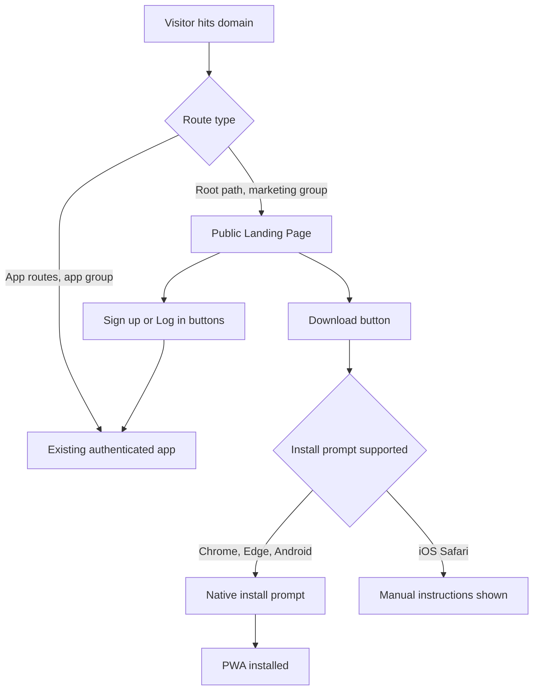

# Public Marketing Site + Installable PWA with Download Button

## Goal

Turn WorkWise into something a prospective customer/organization can reach as a **public website**, and let them **install the app to their device** (desktop or Android) by clicking a "Download" button — without needing the Play Store. This is achieved via a **Progressive Web App (PWA)**: a web app manifest + service worker that makes Chrome/Edge/Android offer native installability, triggered programmatically by our own button.

## Current State (context for the AI)

- file:frontend/src/app/layout.tsx → root layout is `force-dynamic` and wraps everything in `AppLayout`/`Providers`, assuming an authenticated session.
- file:frontend/src/app/page.tsx (route `/`) → this is actually the **CEO Dashboard**, not a marketing page. It fetches dashboard stats immediately and expects a logged-in Clerk user.
- Auth pages live under file:frontend/src/app/auth/ (`login`, `register`, `accept-invite`).
- No `manifest.json`, no service worker, no icon set exist anywhere in file:frontend.
- No `next-pwa`/Workbox dependency in file:frontend/package.json.

## High-Level Architecture

## Step-by-Step Instructions

### 1. Restructure routing: separate public site from the authenticated app

- Move the current authenticated dashboard content out of route `/` into a new authenticated route group, e.g. `frontend/src/app/(app)/` containing today's `page.tsx` (CEO dashboard) and all existing authenticated routes (`employees`, `payroll`, `leave`, etc.). Use Next.js route groups so URLs for existing authenticated pages remain unchanged (e.g. still `/employees`, not `/(app)/employees`).
- Create a new route group, e.g. `frontend/src/app/(marketing)/`, containing a new `page.tsx` at `/` that is the **public landing page** — no Clerk hooks, no `force-dynamic` requirement tied to auth.
- Move the `force-dynamic` + `AppLayout` wrapping (sidebar, header, auth guard) so it only applies to the `(app)` group's layout, not the marketing group. The root file:frontend/src/app/layout.tsx should stay minimal (fonts, providers that don't require auth, PWA manifest link).
- Ensure existing authenticated routes keep working under their current paths and that navigating from the dashboard sidebar is unaffected.
- Add a redirect/guard: if an authenticated user lands on the public `/` marketing page, redirect them into the app's real dashboard route; if an unauthenticated user hits an app route, redirect to `/auth/login` (check whether this guard already exists in `AppLayout`/middleware and reuse it).

### 2. Build the public landing page content

- Headline/value proposition for WorkWise (Kenyan HR & Payroll SaaS), key feature highlights (payroll, leave, attendance, finance books, statutory compliance), pricing teaser linking to the existing `frontend/src/app/pricing/page.tsx`.
- Primary CTAs: **"Download WorkWise"** (installs the PWA) and **"Sign Up" / "Log In"** (routes to existing `auth/register` and `auth/login`).
- Reuse existing design system components (`GlassCard`, `TiltCard`, `FloatingShapes`) from `frontend/src/components/premium/` for visual consistency with the rest of the product.

### 3. Add PWA manifest and icons

- Create `frontend/public/manifest.json` (or `.webmanifest`) with: `name`, `short_name`, `start_url` (point to the authenticated app entry route, not the marketing page, so installed users land directly in the dashboard), `display: "standalone"`, `theme_color`, `background_color`, and an `icons` array with at least 192x192 and 512x512 sizes, including one `purpose: "maskable"` icon.
- Add the icon image assets to `frontend/public/icons/` (reuse/adapt existing branding if available; otherwise flag that new icon artwork is needed).
- Link the manifest in file:frontend/src/app/layout.tsx via Next.js metadata (`manifest` field in the `Metadata` object) so it applies site-wide.

### 4. Add the service worker

- Introduce a service worker using `next-pwa` (recommended for fastest integration with Next.js App Router) or a hand-authored Workbox service worker if `next-pwa` proves incompatible with Next.js 16 App Router — verify compatibility before committing to the dependency, since this is a newer Next.js major version.
- Caching strategy: cache the app shell/static assets (JS/CSS bundles, icons, fonts) for fast reloads and installability; explicitly **exclude API routes** (`/api/*` and the Django backend origin) from caching — payroll/finance/attendance data must always be fetched fresh, never served stale from cache. This is a correctness-critical constraint, not a nice-to-have.
- Register the service worker only in production builds; keep it disabled in local dev to avoid caching issues during development (standard `next-pwa` behavior — confirm this is respected).

### 5. Implement the "Download" button behavior

- Listen for the browser's `beforeinstallprompt` event at the marketing page level; store the event, and only render/enable the "Download" button once this event has fired (Chrome/Edge/Android support).
- On click, call the stored event's prompt method and handle the user's accept/dismiss outcome (e.g., show a toast using the existing `frontend/src/components/ui/toast.tsx`).
- For browsers that never fire `beforeinstallprompt` (notably iOS Safari), detect this case and instead show a small instructional panel/modal: "Tap Share → Add to Home Screen" — do not show a non-functional button.
- Once installed, listen for the `appinstalled` event to update the UI (e.g., swap the button to "Installed ✓" or hide it for that session).

### 6. Verify installability end-to-end

- Confirm HTTPS is enforced in the target deploy environment (already planned per existing security checklist) — service workers will not register over plain HTTP except on `localhost`.
- Use Chrome DevTools → Application → Manifest/Service Workers panels to confirm the manifest is valid and the "Installability" criteria are met (icons present, `start_url` reachable, HTTPS, registered service worker).
- Test the install flow on: Chrome desktop, Chrome Android, and confirm the iOS Safari fallback instructions render correctly (do not attempt to force iOS installability — it's not supported by the platform).

### 7. Do not scope in this pass (explicitly out of scope)

- No native Play Store / TWA packaging — that is a separate future initiative if still desired later, and would reuse this manifest/service worker as its foundation.
- No Web Push notification integration in this pass, even though the existing Notifications feature (`frontend/src/app/notifications/page.tsx`) could eventually use the same service worker for push — call this out as a natural follow-up but do not implement it now.
- No changes to backend (file:backend) required for this feature — it is purely a frontend/static-asset concern.

## Acceptance Criteria

- Visiting the root domain unauthenticated shows a public marketing page (not the CEO dashboard, not a login redirect).
- All existing authenticated routes (`/employees`, `/payroll`, `/leave`, `/finance/*`, `/hr`, `/manager`, `/settings/*`, etc.) continue to work exactly as before, at their existing paths.
- A "Download" button on the marketing page triggers native install prompts on supporting browsers, and shows manual instructions on iOS Safari.
- Lighthouse/DevTools reports the site as installable (PWA installability checks pass).
- API calls (payroll, finance, employee data) are never served from the service worker cache — verified by inspecting Network tab responses coming from the network, not cache, after installation.