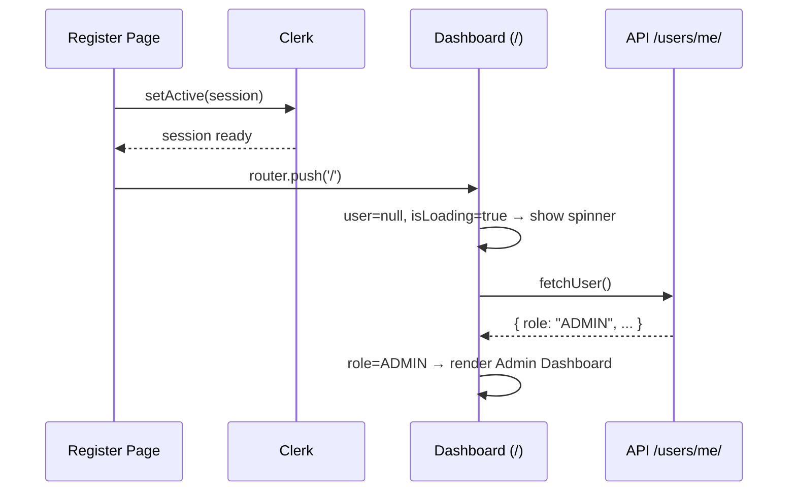

# WorkWise SaaS — Bug Fix & Feature Plan

## Overview

This spec documents the root causes and complete solutions for all issues identified across our conversation. There are **4 problem areas** to resolve, grouped into 3 implementation tickets.

## Problem 1 — Clerk Auth Not Configured (Root of All 401 Errors)

### Root Cause

`backend/.env` is missing `CLERK_ISSUER`, `CLERK_ALLOWED_ISSUERS`, `CLERK_JWKS_URL`, and `CLERK_AUDIENCE`. The `ClerkAuthentication` class in file:backend/core/authentication.py refuses all tokens when these are absent, causing every API call to return HTTP 401.

**Secondary blocker:** Even after adding the issuer, `CLERK_AUDIENCE` guard at line 156–161 of `authentication.py` returns `None` when the value is an empty string — but Clerk dev tokens have no `aud` claim by default. The code must be patched to skip audience validation when `CLERK_AUDIENCE` is empty.

### Fix

**Step 1 — Add to ****`backend/.env`****:**

```
CLERK_ISSUER=https://sought-narwhal-50.clerk.accounts.dev
CLERK_ALLOWED_ISSUERS=https://sought-narwhal-50.clerk.accounts.dev
CLERK_JWKS_URL=https://sought-narwhal-50.clerk.accounts.dev/.well-known/jwks.json
CLERK_AUDIENCE=
MPESA_STK_CALLBACK_URL=https://almanac-hassle-remake.ngrok-free.dev/api/mpesa/stk-push-callback/
```

**Step 2 — Patch ****`authentication.py`****:** Change the audience guard so that when `CLERK_AUDIENCE` is empty, `jwt.decode()` is called with `audience=None` (skip validation) instead of failing.

### Impact of Fix

Once this is resolved: sidebar shows all nav items, all API calls succeed, M-Pesa STK push becomes reachable, and the user profile loads with `role: "ADMIN"`.

## Problem 2 — Post-Registration Redirect Goes to Wrong Page

### Root Cause

After email verification in file:frontend/src/app/auth/register/`[[...rest]]/page.tsx` (line 195), the code does `router.push('/')`. The dashboard (`/`) then checks `user.role` — but at this exact moment, `user` is still `null` because `fetchUser()` hasn't completed yet (it's async and the backend was returning 401 anyway).

The dashboard's empty state then renders with a prominent **"Add First Employee → /employees"** button, making it look like a redirect happened.

### Fix

After `setActive()` succeeds in `handleVerify()`, redirect to `/` but add a **role-aware redirect** inside the dashboard that waits for the user profile to load before deciding what to show. Specifically:

- While `isLoading` is true (profile fetch in progress), show a full-screen loading spinner — **not** the empty state
- Once `user` loads with `role === 'ADMIN'`, show the admin dashboard
- The empty state CTA should be changed from a big redirect button to an inline inline panel — so it doesn't feel like a page navigation



## Problem 3 — Notifications: "View All" Button Does Nothing + No Notifications Page

### Root Cause

In file:frontend/src/components/layout/NotificationsPanel.tsx (line 189), the "View all notifications →" button is a plain `<button>` with no `onClick` handler and no `href`. It does nothing.

Additionally, notifications are **hardcoded static data** — they are not fetched from the backend. The `notification_preferences` field exists on the `User` model but there is no backend model or API for storing/retrieving actual notification events.

### Solution Architecture

#### Backend — New Notification Model & API

Create a `Notification` model in the `users` app (or a new `notifications` app):

| Field | Type | Notes |
| --- | --- | --- |
| `id` | UUID | Primary key |
| `tenant` | FK → Tenant | Tenant scoping |
| `recipient` | FK → User | Target user |
| `type` | CharField | `payroll`, `leave`, `employee`, `system` |
| `title` | CharField | Short heading |
| `message` | TextField | Full body |
| `is_read` | BooleanField | Default False |
| `created_at` | DateTimeField | Auto |
| `action_url` | CharField | Optional deep-link (e.g. `/leave`) |

**New API endpoints:**

- `GET /api/notifications/` — list all for current user (query param `?unread=true`)
- `POST /api/notifications/<id>/read/` — mark single as read
- `POST /api/notifications/read-all/` — mark all as read

**Auto-generation hooks:** Use Django signals to create notifications on key events:

- Payroll run processed → notify ADMIN/HR
- Leave request submitted → notify ADMIN/HR
- Leave approved/rejected → notify the requesting employee
- New employee added → notify ADMIN

#### Frontend — Notifications Page

New page at `frontend/src/app/notifications/page.tsx` with:

- **Tab bar:** "All" | "Unread" | "Read"
- **Category filter chips:** Payroll, Leave, Employee, System
- **Notification cards** with read/unread visual distinction
- **Bulk "Mark all read"** action
- Individual dismiss (delete) per notification

The `NotificationsPanel` dropdown "View all →" button becomes a `<Link href="/notifications">` that closes the panel and navigates to the full page.

```wireframe

<html>
<head>
<style>
* { box-sizing: border-box; margin: 0; padding: 0; font-family: system-ui, sans-serif; }
body { background: #f8fafc; padding: 32px; }
.page-header { margin-bottom: 24px; }
.page-header h1 { font-size: 28px; font-weight: 700; color: #0f172a; }
.page-header p { color: #64748b; font-size: 14px; margin-top: 4px; }
.toolbar { display: flex; align-items: center; justify-content: space-between; margin-bottom: 20px; gap: 12px; flex-wrap: wrap; }
.tabs { display: flex; gap: 4px; background: #fff; border: 1px solid #e2e8f0; border-radius: 12px; padding: 4px; }
.tab { padding: 8px 18px; border-radius: 8px; font-size: 13px; font-weight: 600; cursor: pointer; color: #64748b; border: none; background: none; }
.tab.active { background: #0f172a; color: #fff; }
.tab .badge { display: inline-block; background: #ef4444; color: #fff; border-radius: 99px; font-size: 10px; padding: 1px 6px; margin-left: 6px; }
.filters { display: flex; gap: 8px; }
.chip { padding: 6px 14px; border-radius: 99px; border: 1px solid #e2e8f0; font-size: 12px; font-weight: 600; color: #475569; background: #fff; cursor: pointer; }
.chip.active { background: #0f172a; color: #fff; border-color: #0f172a; }
.mark-all { font-size: 13px; color: #0d9488; font-weight: 600; cursor: pointer; background: none; border: none; white-space: nowrap; }
.section-label { font-size: 11px; font-weight: 700; color: #94a3b8; text-transform: uppercase; letter-spacing: 0.1em; margin: 20px 0 10px; }
.notif-card { background: #fff; border: 1px solid #e2e8f0; border-radius: 16px; padding: 16px 20px; display: flex; gap: 14px; align-items: flex-start; margin-bottom: 10px; position: relative; }
.notif-card.unread { background: #f0fdfa; border-color: #99f6e4; }
.notif-icon { width: 40px; height: 40px; border-radius: 12px; display: flex; align-items: center; justify-content: center; font-size: 18px; flex-shrink: 0; }
.icon-payroll { background: #ccfbf1; }
.icon-leave { background: #fef3c7; }
.icon-employee { background: #ede9fe; }
.icon-system { background: #dbeafe; }
.notif-body { flex: 1; }
.notif-title { font-size: 14px; font-weight: 700; color: #0f172a; display: flex; align-items: center; gap: 8px; }
.unread-dot { width: 8px; height: 8px; border-radius: 50%; background: #0d9488; flex-shrink: 0; }
.notif-msg { font-size: 13px; color: #64748b; margin-top: 3px; line-height: 1.5; }
.notif-meta { display: flex; align-items: center; gap: 10px; margin-top: 8px; }
.notif-time { font-size: 11px; color: #94a3b8; }
.notif-link { font-size: 11px; color: #0d9488; font-weight: 600; text-decoration: none; }
.notif-actions { display: flex; gap: 8px; align-items: center; }
.btn-read { font-size: 11px; color: #0d9488; font-weight: 600; background: none; border: none; cursor: pointer; }
.btn-dismiss { font-size: 11px; color: #94a3b8; background: none; border: none; cursor: pointer; }
.empty { text-align: center; padding: 60px 20px; color: #94a3b8; }
.empty-icon { font-size: 40px; margin-bottom: 12px; }
.empty p { font-size: 14px; }
</style>
</head>
<body>
<div class="page-header">
  <h1>Notifications</h1>
  <p>Stay updated on payroll, leave requests, and team activity.</p>
</div>

<div class="toolbar">
  <div style="display:flex; gap:12px; align-items:center; flex-wrap:wrap;">
    <div class="tabs">
      <button class="tab active">All <span class="badge">3</span></button>
      <button class="tab">Unread <span class="badge">3</span></button>
      <button class="tab">Read</button>
    </div>
    <div class="filters">
      <button class="chip active">All Types</button>
      <button class="chip">💰 Payroll</button>
      <button class="chip">🌴 Leave</button>
      <button class="chip">👥 Employee</button>
      <button class="chip">⚙️ System</button>
    </div>
  </div>
  <button class="mark-all">✓ Mark all as read</button>
</div>

<div class="section-label">Unread — 3</div>

<div class="notif-card unread">
  <div class="notif-icon icon-payroll">💰</div>
  <div class="notif-body">
    <div class="notif-title">Payroll Run Completed <span class="unread-dot"></span></div>
    <div class="notif-msg">June 2026 payroll has been processed successfully for 24 employees. Total net pay: KES 1,240,000.</div>
    <div class="notif-meta">
      <span class="notif-time">2 minutes ago</span>
      <a class="notif-link" href="#">View Payroll →</a>
    </div>
  </div>
  <div class="notif-actions">
    <button class="btn-read">Mark read</button>
    <button class="btn-dismiss">✕</button>
  </div>
</div>

<div class="notif-card unread">
  <div class="notif-icon icon-employee">👥</div>
  <div class="notif-body">
    <div class="notif-title">New Employee Onboarded <span class="unread-dot"></span></div>
    <div class="notif-msg">Jane Wanjiku has completed onboarding and is now active in the system.</div>
    <div class="notif-meta">
      <span class="notif-time">1 hour ago</span>
      <a class="notif-link" href="#">View Employee →</a>
    </div>
  </div>
  <div class="notif-actions">
    <button class="btn-read">Mark read</button>
    <button class="btn-dismiss">✕</button>
  </div>
</div>

<div class="notif-card unread">
  <div class="notif-icon icon-leave">🌴</div>
  <div class="notif-body">
    <div class="notif-title">Leave Request Pending <span class="unread-dot"></span></div>
    <div class="notif-msg">Brian Otieno has submitted an annual leave request (Jun 20 – Jun 27) that needs your approval.</div>
    <div class="notif-meta">
      <span class="notif-time">3 hours ago</span>
      <a class="notif-link" href="#">Review Request →</a>
    </div>
  </div>
  <div class="notif-actions">
    <button class="btn-read">Mark read</button>
    <button class="btn-dismiss">✕</button>
  </div>
</div>

<div class="section-label">Read — 2</div>

<div class="notif-card">
  <div class="notif-icon icon-system">⚙️</div>
  <div class="notif-body">
    <div class="notif-title">System Maintenance</div>
    <div class="notif-msg">Scheduled maintenance on Sunday 9–10 PM EAT. No downtime expected.</div>
    <div class="notif-meta">
      <span class="notif-time">Yesterday</span>
    </div>
  </div>
  <div class="notif-actions">
    <button class="btn-dismiss">✕</button>
  </div>
</div>

<div class="notif-card">
  <div class="notif-icon icon-payroll">💰</div>
  <div class="notif-body">
    <div class="notif-title">Bank Export Ready</div>
    <div class="notif-msg">Equity Bank CSV export for May payroll is ready to download.</div>
    <div class="notif-meta">
      <span class="notif-time">2 days ago</span>
      <a class="notif-link" href="#">Download →</a>
    </div>
  </div>
  <div class="notif-actions">
    <button class="btn-dismiss">✕</button>
  </div>
</div>
</body>
</html>
```

## Problem 4 — M-Pesa STK Push Failing in Sandbox

### Root Cause Analysis

Your `.env` already has valid sandbox credentials (`MPESA_CONSUMER_KEY`, `MPESA_CONSUMER_SECRET`, `MPESA_PASSKEY`, `MPESA_EXPRESS_SHORTCODE=174379`). The STK push was failing purely because of the **401 auth error** — the request never reached the M-Pesa logic.

However, there is a **secondary issue**: `MPESA_STK_CALLBACK_URL` is set via `MPESA_CALLBACK_URL` in `.env` (line 68), but file:backend/tenants/views.py reads `settings.MPESA_STK_CALLBACK_URL` (a different key). The settings file maps `MPESA_STK_CALLBACK_URL` from env, but your `.env` uses `MPESA_CALLBACK_URL` as the key name. This means `MPESA_STK_CALLBACK_URL` is empty in settings, causing the code to fall back to the hardcoded ngrok URL.

### Fix

Add this line to `backend/.env`:

```
MPESA_STK_CALLBACK_URL=https://almanac-hassle-remake.ngrok-free.dev/api/mpesa/stk-push-callback/
```

### Sandbox Simulation Behavior

With sandbox credentials and a valid ngrok tunnel:

- Any Safaricom-format number (e.g. `0708374149`) will receive a simulated STK push prompt
- Safaricom sandbox **does not send a real SMS** — it simulates the callback automatically after ~10 seconds
- The `MpesaExpressCallbackView` at `/api/mpesa/stk-push-callback/` will receive the result and update the `MpesaSubscriptionPayment` record
- The frontend polls `/api/mpesa/stk-push/status/` every 2.5 seconds and will show "Payment Successful" when the callback arrives

<user_quoted_section>Note: Your ngrok URL almanac-hassle-remake.ngrok-free.dev must be actively running (ngrok http 8000) for Safaricom's sandbox to reach your local server.</user_quoted_section>

## Summary of All Changes

| # | Area | Files Changed | Type |
| --- | --- | --- | --- |
| 1 | Clerk Auth | `backend/.env`, `backend/core/authentication.py` | Config + Code fix |
| 2 | Post-registration redirect | `frontend/src/app/page.tsx` | Code fix |
| 3 | Notifications panel | `frontend/src/components/layout/NotificationsPanel.tsx` | Code fix |
| 4 | Notifications page | `frontend/src/app/notifications/page.tsx` (new) | New feature |
| 5 | Notification backend model | `backend/users/models.py`, new migration, new views, `backend/config/urls.py` | New feature |
| 6 | M-Pesa env key | `backend/.env` | Config fix |